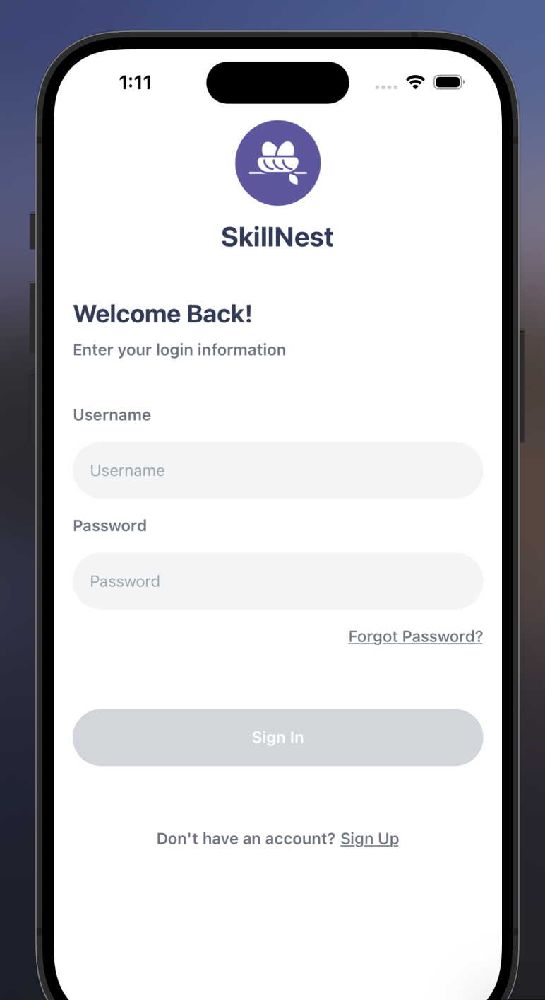
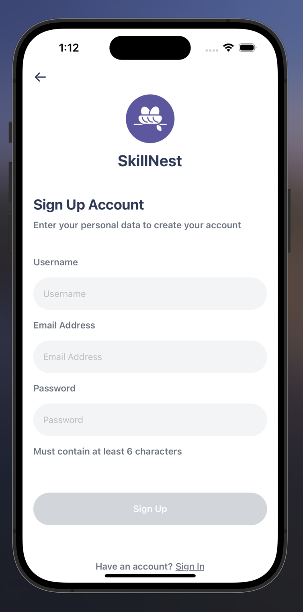
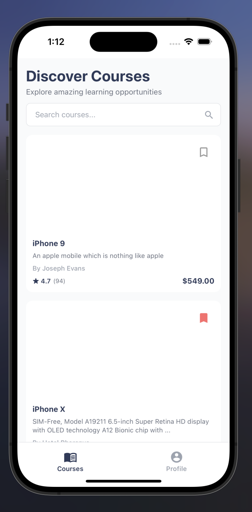
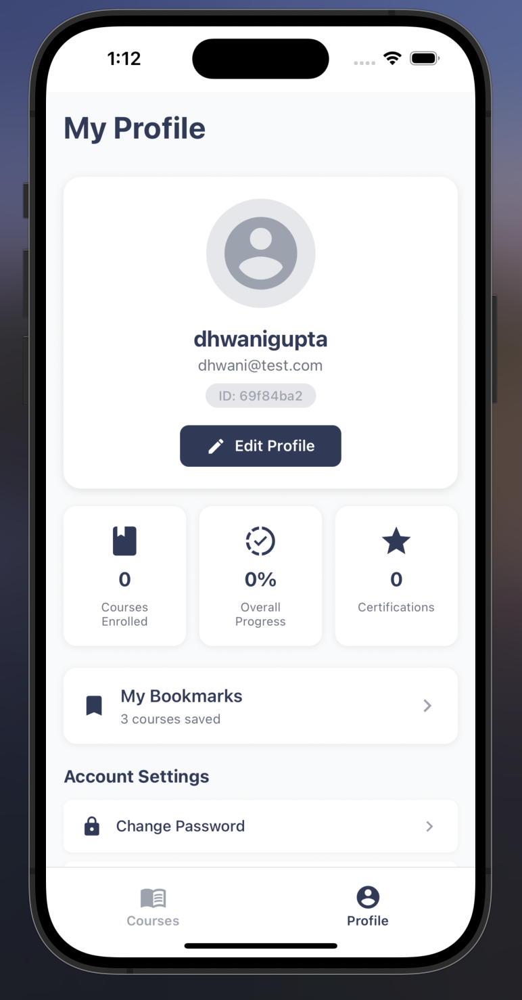
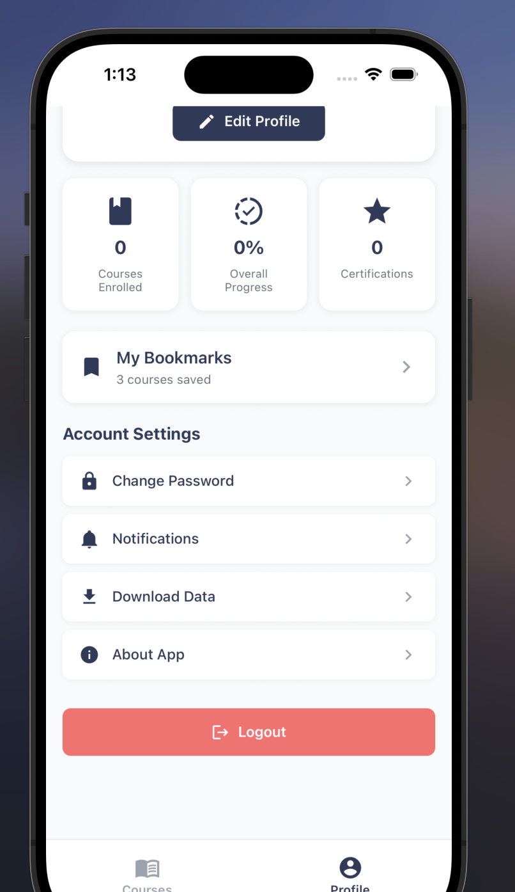
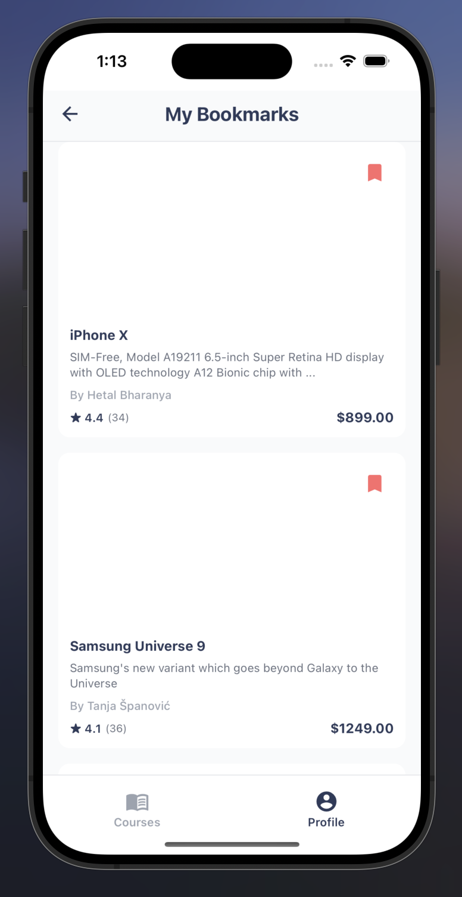

# Learning Management System (Expo + React Native)

This is a small learning-management mobile app built with Expo, Expo Router and TypeScript. The app includes authentication, a browseable course catalog, course details, bookmarking, and a profile screen.

## Quick setup

Follow these steps to get the project running locally.

1. Install dependencies

```bash
# from project root
npm install
```

2. Install native Expo modules (ensure you have node and npm available)

```bash
# With Expo-managed projects, prefer expo install for native modules
npx expo install @react-native-async-storage/async-storage
```

3. Start the dev server (clear cache if you see native module errors)

```bash
npm start -- -c
# or
npx expo start --clear
```

4. Run on a device or simulator

```bash
# iOS simulator
npm run ios

# Android emulator
npm run android

# Web (optional)
npm run web
```

If you see errors like "Native module is null, cannot access legacy storage", stop the server and restart with the `--clear` flag as shown above.

## Environment variables

Create a `.env` file in the project root (or use a `.env.local`) and add the variables below. These are the variables the app expects at runtime.

```env
# API base URL (example)
API_BASE_URL=https://api.example.com

# Optional: endpoints or keys your backend requires
AUTH_CLIENT_ID=your-client-id
AUTH_CLIENT_SECRET=your-client-secret
```

Notes:

- The app uses `API_BASE_URL` when calling the backend API (login, courses endpoints). Update `src/api` if your backend paths differ.
- If you don't have a backend, the app will still run but some features (auth, real enrollments) will be mocked or limited.

## Where to look in the code

- `src/context/AuthContext.tsx` — authentication state, token storage (SecureStore)
- `src/api` — API wrappers (auth and courses)
- `screens/` — main screens (CoursesPage, CourseDetailsPage, ProfileScreen)
- `components/` — reusable UI components (CourseCard, Button, Header)

## Known issues & notes

- If you add or remove native packages, restart Expo with `--clear`.
- The app stores bookmarks in `AsyncStorage` under the key `bookmarkedCourses`.
- Tokens are stored securely using `expo-secure-store` in `AuthContext`.

If you want I can also add a minimal `.env.example` file and a short `SETUP.md` with troubleshooting steps.

## Screen shots







